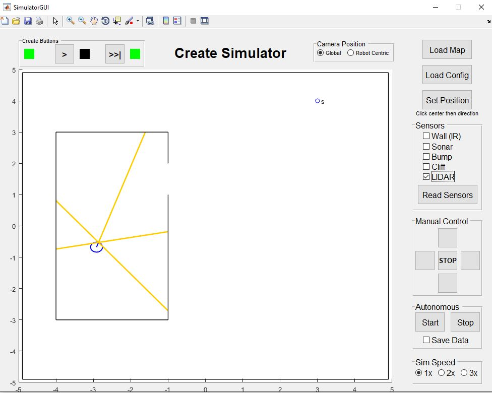
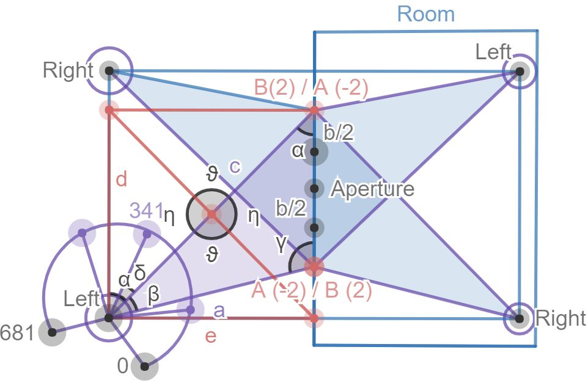

## iRobot Create

This project is a minimalistic reference implementation of a reactive, subsumption based mobile robot based
on the iRobot Create robotic platform. The Create is built along similar lines as the Roomba vacuum cleaner.
It contains three bump sensors (on the front, on the left and on the right), a Camera,
a Lidar sensor and three Sonars on the front, left and right.
The create can be controlled via the Open Interface command through the serial port connector.
To make things simpler, since the above commands are not very intuitive the Matlab Toolbox for the iRobot Create was created.

## iRobot Create Matlab Simulator Toolbox set up instructions

This demo project can be run, tested, modified and expanded using the Matlab iRobot Create Simulator Toolbox.

- Download the toolbox zip file iRobotCreateSimulatorToolbox.zip under https://sourceforge.net/projects/createsim/ first.
- Unzip the toolbox to extract the toolbox folder containing all the functions and documentation. 
- Place that folder in a permanent location on your computer. (e.g. C:\Program Files\MATLAB\R20XXx\toolbox) or (.../myuser/Library/MATLAB/ on Mac or Linux) 
- Start MATLAB.
- In the menu toolbar, click File, then select Set Path. 
- Click Add Folder with Subfolders, navigate to the toolbox folder you just saved, select it and press OK. 
- Click the Save button, then press Close. 

## Run the demo project in Matlab

- Place this demo project in your Matlab working folder
- Make sure the map file map.txt is saved as plain .txt file
- Start the Matlab Simulator UI by typing SimulatorGUI in the command line
- Once the Simulator UI is up and running import the map by pressing Load Map

- Load the autonomous control program iRobotController.m by pressing Start

## Architecture

In the demo program the robot performs two tasks. During the first task it finds the exit of a 
room and leaves without bumping. In the second task it detects a beacon with his Camera and performs homing.
The robot accomplishes the above tasks by means of different behaviours. Behaviours run in parallel and
are executed in turns coordinated by an arbitrator. If more than one behaviour claims access to the robot's 
actuators the higher priority behaviour subsumes the others from using the actuators. 
Beyond behaviour coordination, the arbitrator polls sensors and forwards the information to the behaviours.
The arbitrator keeps track of the system goals stored in a queue and dequeues them as soon as they are achieved. 
The control loop terminates as soon as all goals are achieved.
Each goal defined in the system depends on a predefined set of behaviours.

While the robot is exploring its environment it detects special landmarks such as the exit of the room and 
stores them short term for the duration of a control cycle. Landmarks are constructed and maintained in a cartographic 
module and available for use in the arbitrator.

## Licensing 

Copyright (c) 2019, Timea Magyar
All rights reserved.
 
Redistribution and use in source and binary forms, with or without
modification, are permitted provided that the following conditions are met:

Redistributions of source code must retain the above copyright notice, this
list of conditions and the following disclaimer.

Redistributions in binary form must reproduce the above copyright notice,
this list of conditions and the following disclaimer in the documentation
and/or other materials provided with the distribution

THIS SOFTWARE IS PROVIDED BY THE COPYRIGHT HOLDERS AND CONTRIBUTORS "AS IS"
AND ANY EXPRESS OR IMPLIED WARRANTIES, INCLUDING, BUT NOT LIMITED TO, THE
IMPLIED WARRANTIES OF MERCHANTABILITY AND FITNESS FOR A PARTICULAR PURPOSE ARE
DISCLAIMED. IN NO EVENT SHALL THE COPYRIGHT OWNER OR CONTRIBUTORS BE LIABLE
FOR ANY DIRECT, INDIRECT, INCIDENTAL, SPECIAL, EXEMPLARY, OR CONSEQUENTIAL
DAMAGES (INCLUDING, BUT NOT LIMITED TO, PROCUREMENT OF SUBSTITUTE GOODS OR
SERVICES; LOSS OF USE, DATA, OR PROFITS; OR BUSINESS INTERRUPTION) HOWEVER
CAUSED AND ON ANY THEORY OF LIABILITY, WHETHER IN CONTRACT, STRICT LIABILITY,
OR TORT (INCLUDING NEGLIGENCE OR OTHERWISE) ARISING IN ANY WAY OUT OF THE USE
OF THIS SOFTWARE, EVEN IF ADVISED OF THE POSSIBILITY OF SUCH DAMAGE.
